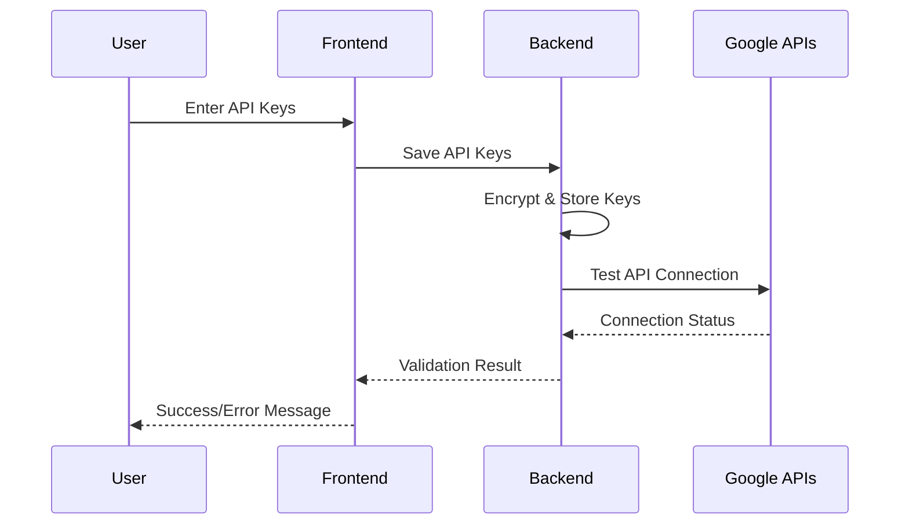
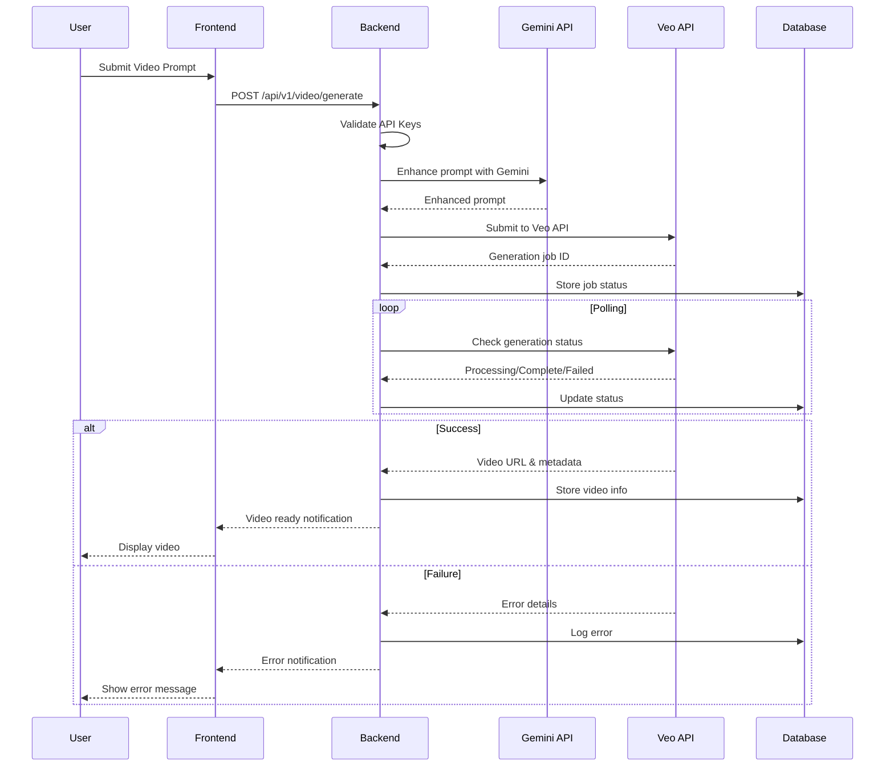
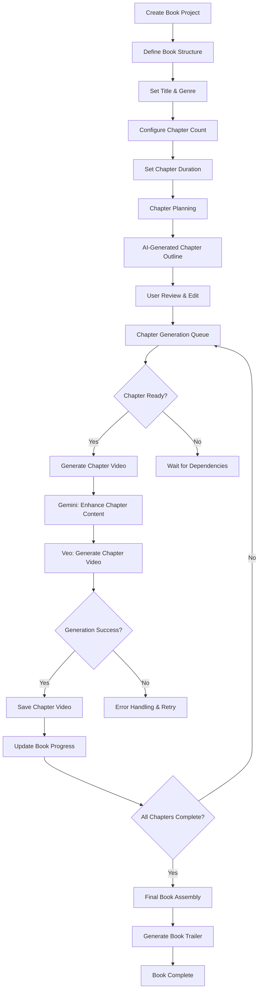
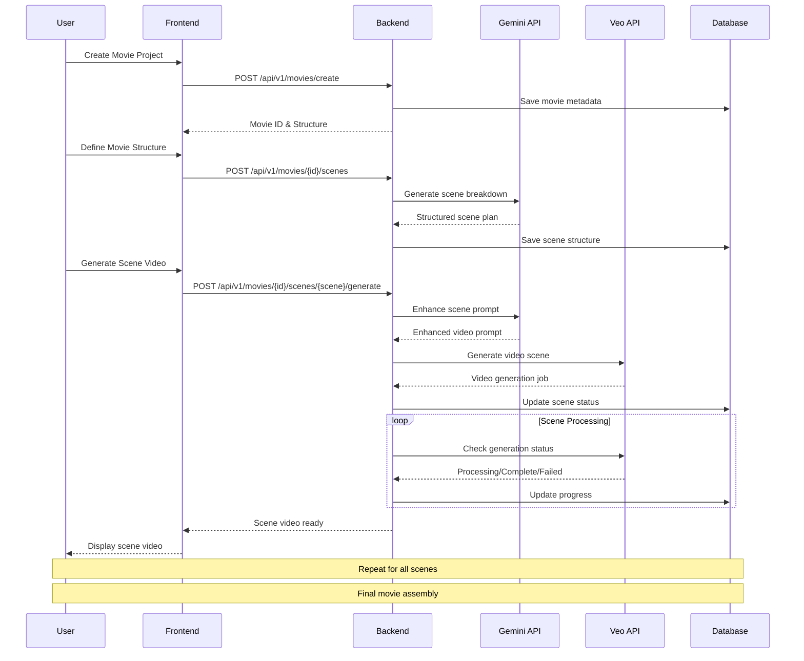
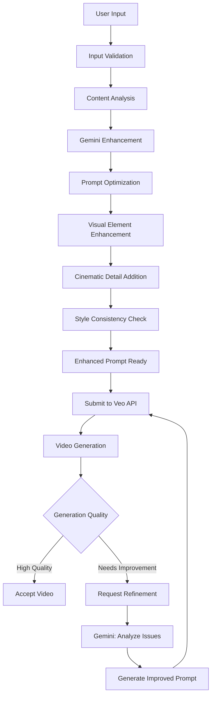
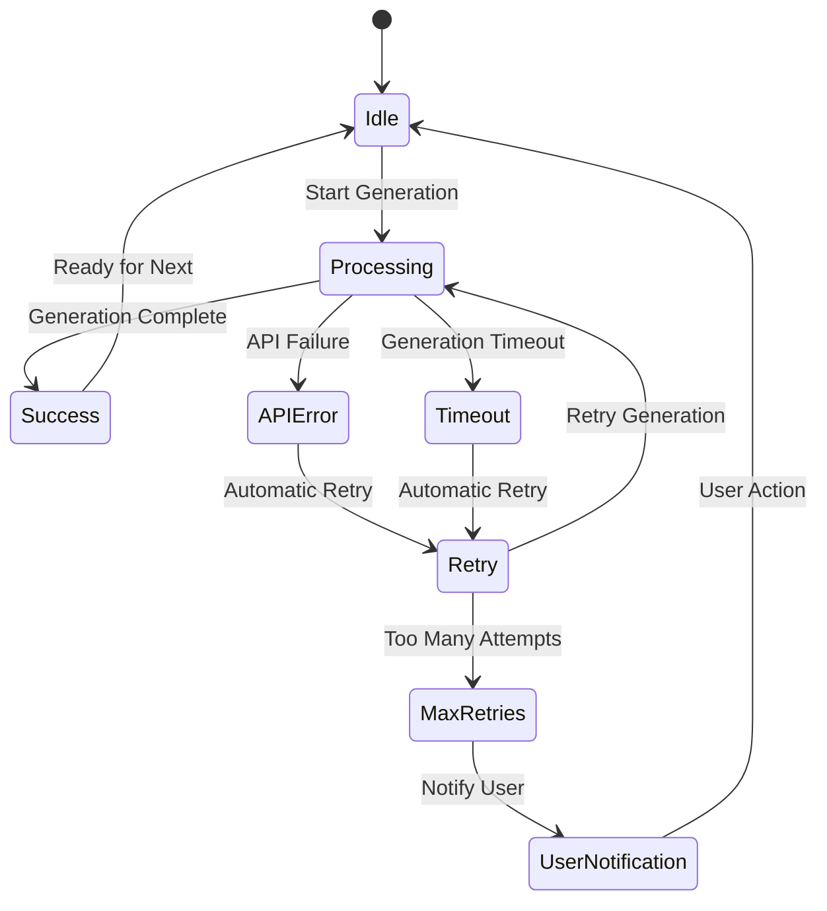
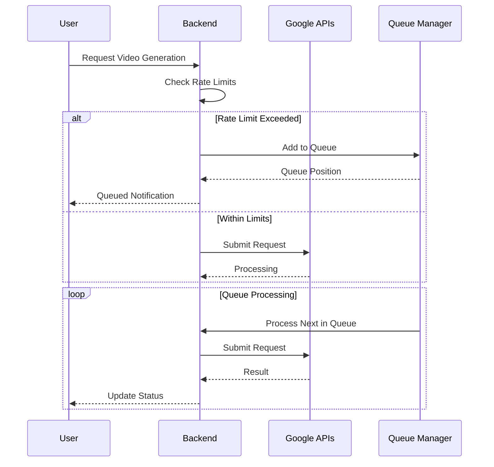
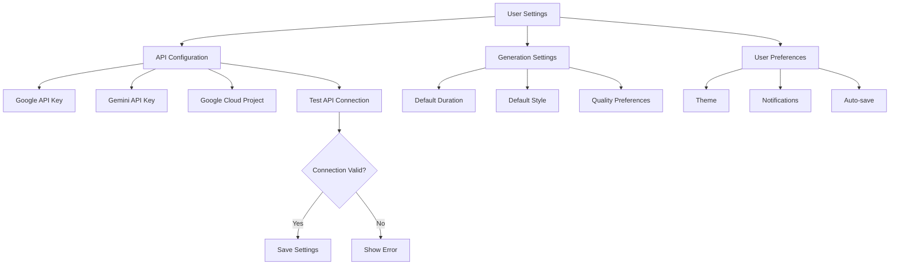
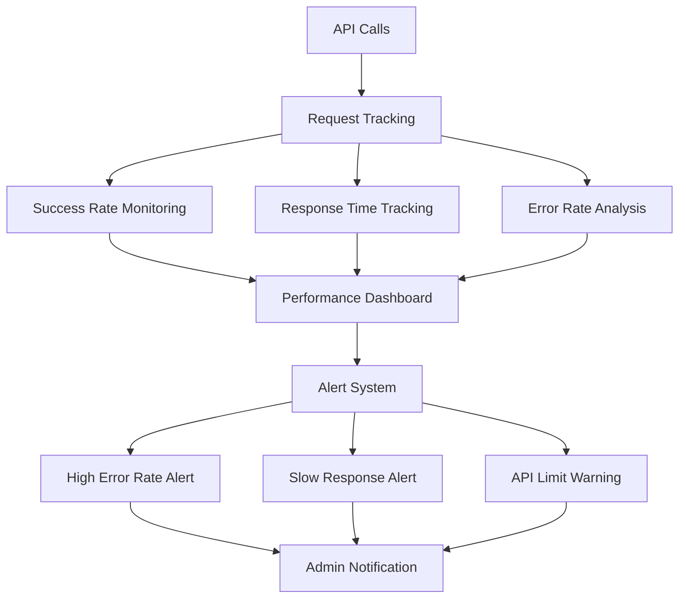
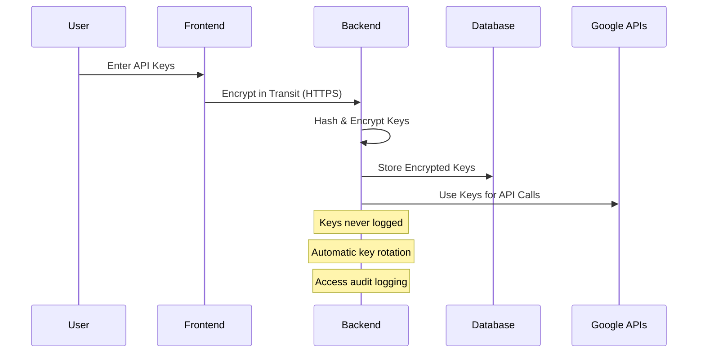

# AI Communication Flows

This document illustrates the communication flows between VeoGen and Google's AI services (Veo Video API and Gemini API).

## Overview

VeoGen integrates with two main Google AI services:
- **Google Veo API** - For video generation
- **Google Gemini API** - For text enhancement and AI assistance

## Authentication Flow

## Video Generation Flow

## Book Maker Flow

## Movie Maker Flow

## AI Enhancement Pipeline

## Error Handling & Recovery

## API Rate Limiting

## Settings & Configuration

## Monitoring & Analytics

## Security Considerations

---

## Next Steps

- [API Configuration Guide](../api/configuration.md)
- [Troubleshooting Guide](../troubleshooting/api-issues.md)
- [Performance Optimization](../performance/optimization.md) 