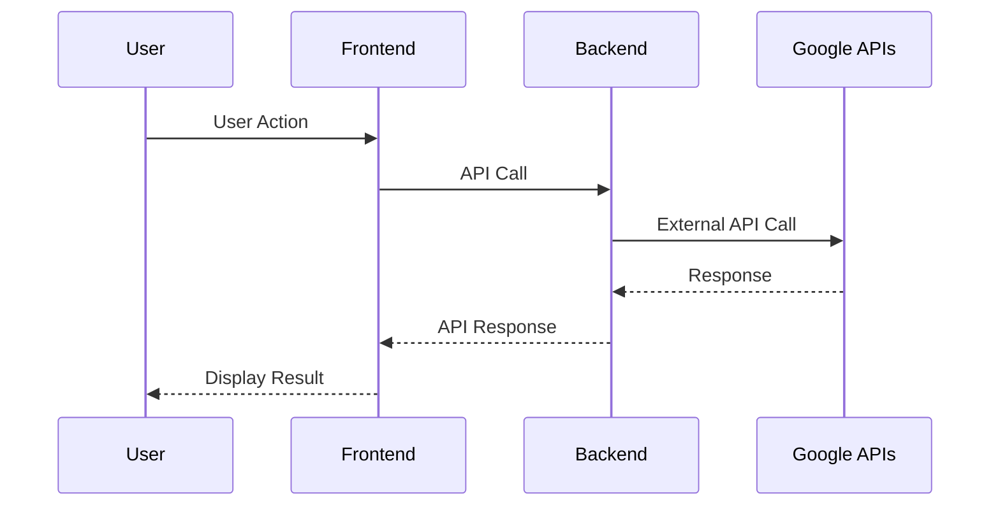
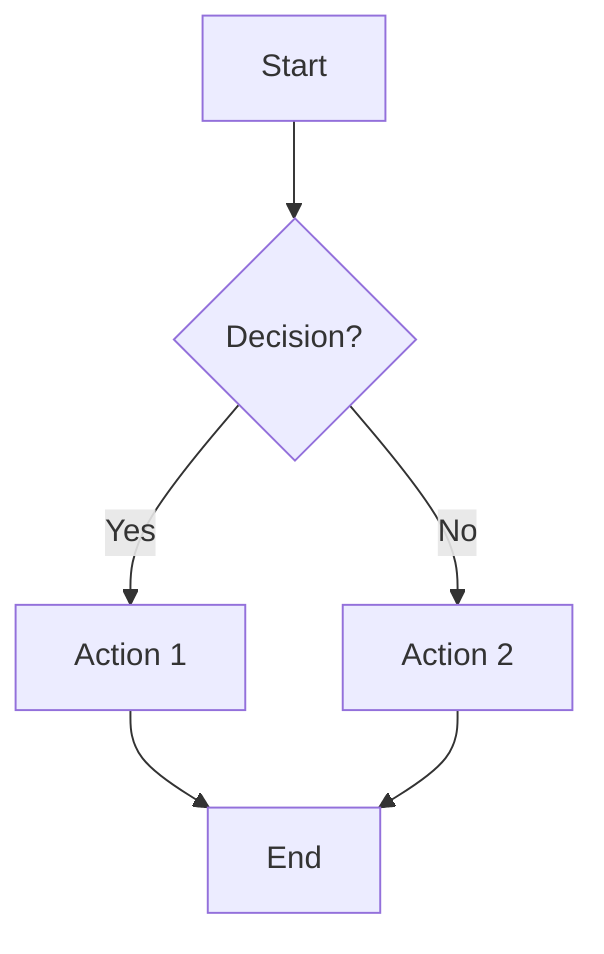
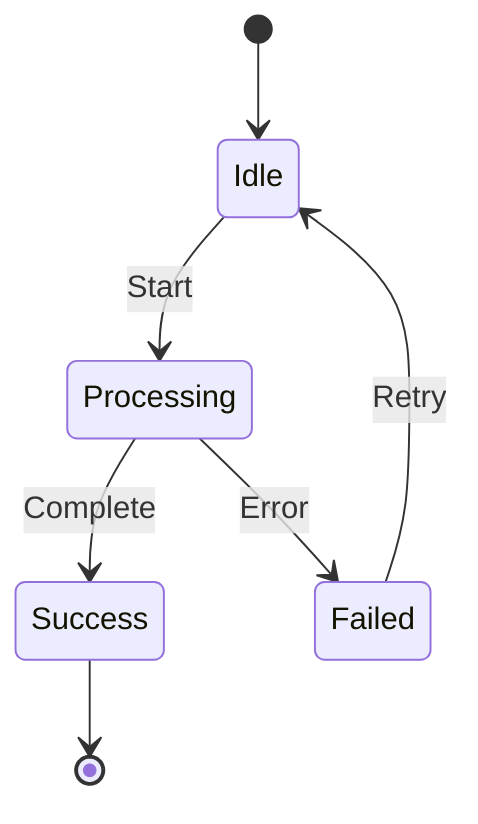
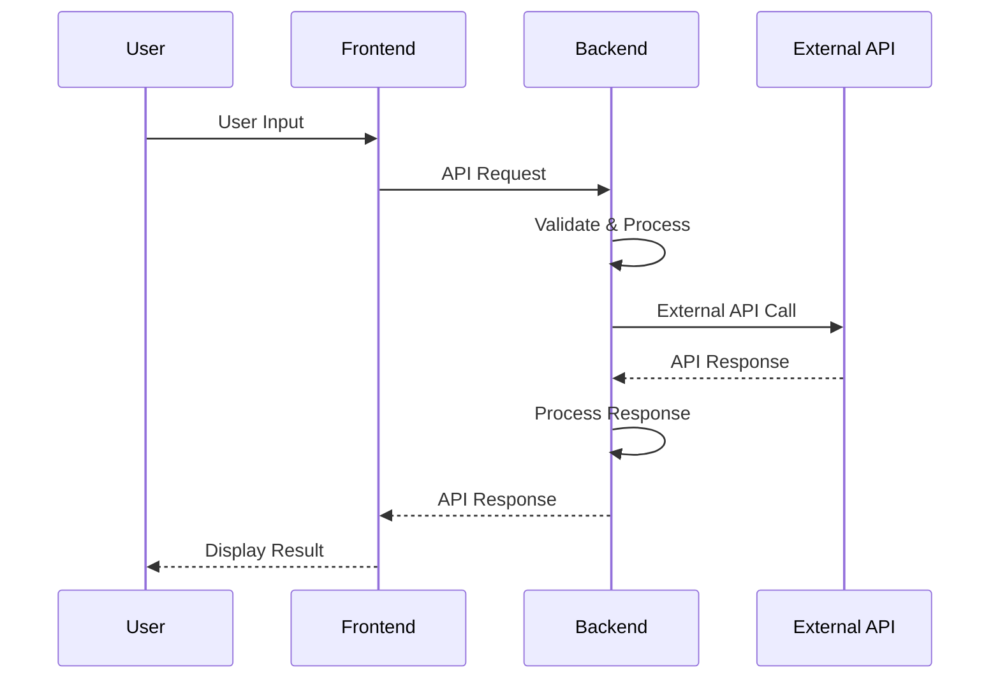
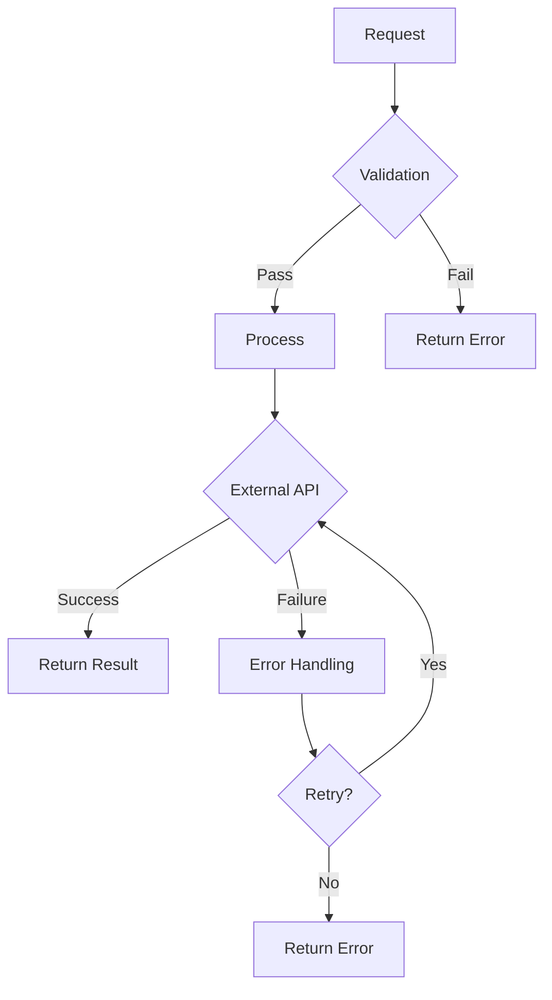
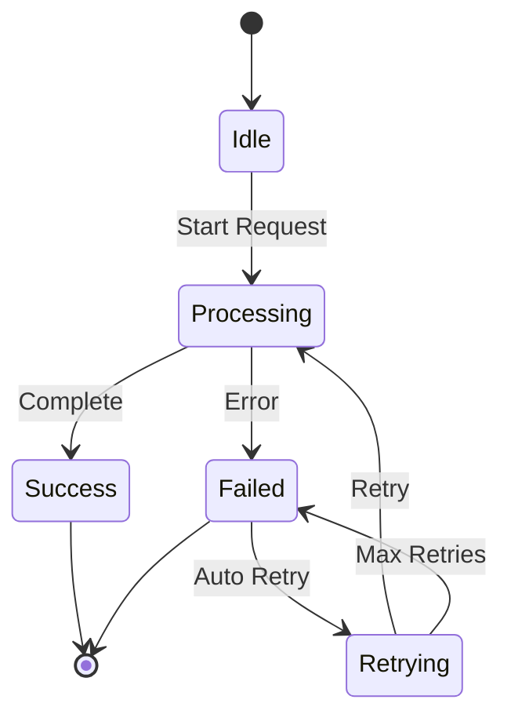
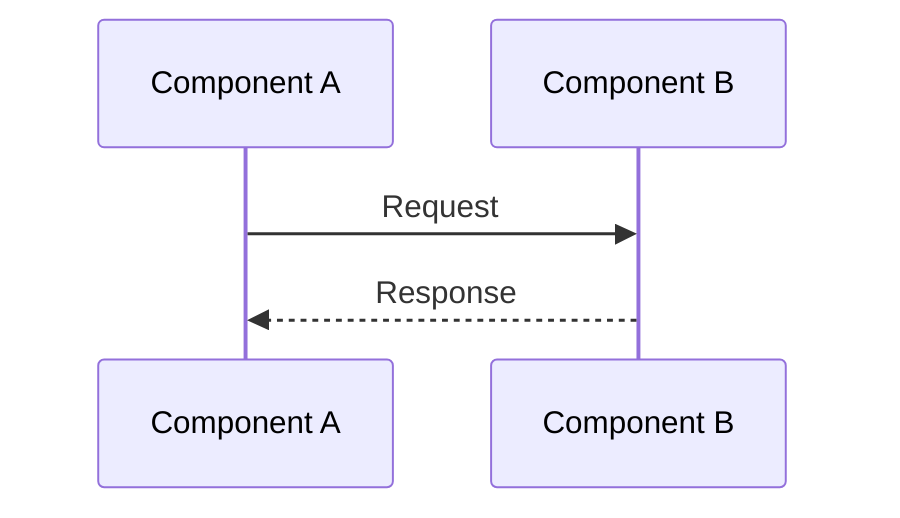
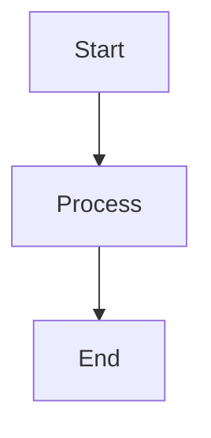
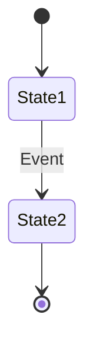

# Mermaid Diagrams Guide

This guide explains the Mermaid diagrams used throughout VeoGen's documentation to visualize AI communication flows and system architecture.

## Diagram Types Used

### 1. Sequence Diagrams
Show the flow of communication between different components over time.

**Example:**

### 2. Flowcharts
Show decision-making processes and workflow steps.

**Example:**

### 3. State Diagrams
Show how systems change states over time.

**Example:**

## Key Components in Our Diagrams

### User Interface Components
- **U** - User
- **F** - Frontend (React App)
- **UI** - User Interface

### Backend Components
- **B** - Backend (FastAPI)
- **DB** - Database (PostgreSQL)
- **Q** - Queue Manager
- **S** - Settings Service

### External Services
- **G** - Google APIs (Gemini)
- **V** - Veo Video API
- **C** - Cloud Services

### AI Components
- **AI** - AI Processing
- **ML** - Machine Learning
- **NLP** - Natural Language Processing

## Reading the Diagrams

### Sequence Diagrams
1. **Top to Bottom** - Time flows from top to bottom
2. **Left to Right** - Components are arranged left to right
3. **Arrows** - Show direction of communication
4. **Dashed Lines** - Show responses/returns
5. **Notes** - Provide additional context

### Flowcharts
1. **Rectangles** - Process steps
2. **Diamonds** - Decision points
3. **Arrows** - Show flow direction
4. **Text on Arrows** - Show conditions

### State Diagrams
1. **Circles** - States
2. **Arrows** - State transitions
3. **Text on Arrows** - Trigger conditions
4. **[*]** - Start/End states

## Common Patterns in VeoGen

### API Communication Pattern

### Error Handling Pattern

### State Management Pattern

## Creating Your Own Diagrams

### Basic Sequence Diagram

### Basic Flowchart

### Basic State Diagram

## Tips for Effective Diagrams

1. **Keep it Simple** - Focus on the main flow, not every detail
2. **Use Clear Names** - Make component names descriptive
3. **Group Related Steps** - Use notes to group related actions
4. **Show Error Paths** - Include error handling in your diagrams
5. **Update Regularly** - Keep diagrams in sync with code changes

## Tools for Creating Mermaid Diagrams

1. **Online Editor** - [Mermaid Live Editor](https://mermaid.live/)
2. **VS Code Extension** - Mermaid Preview
3. **GitHub** - Native Mermaid support in markdown
4. **GitLab** - Native Mermaid support in markdown

## Integration with Documentation

These diagrams are integrated into our documentation using:

- **docsify** - Renders Mermaid diagrams automatically
- **GitHub Pages** - Native Mermaid support
- **Static Site Generators** - Many support Mermaid via plugins

---

## Next Steps

- [AI Communication Flows](ai-communication-flows.md)
- [System Architecture](system-architecture.md)
- [Book & Movie Maker Guide](../features/book-movie-maker-guide.md) 