# Book & Movie Maker Guide

This guide explains how to use VeoGen's AI-powered book and movie creation features.

## Overview

VeoGen combines Google's Gemini AI for content enhancement and Veo API for video generation to create complete multimedia projects.

## Book Maker

Create AI-generated video books with multiple chapters and narrative structure.

### Book Creation Process

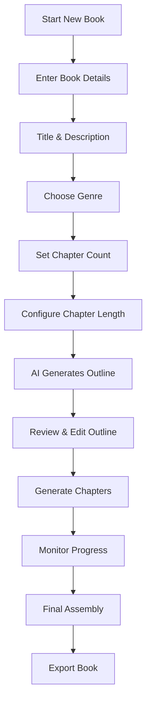

### Chapter Generation Flow

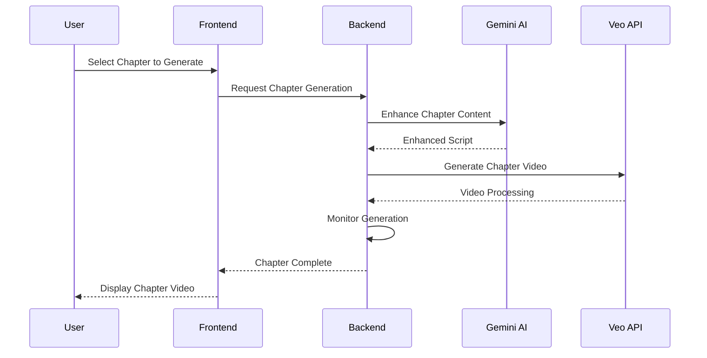

### Book Project Structure

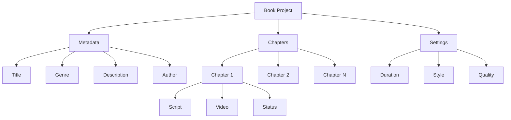

## Movie Maker

Create cinematic movies with multiple scenes, character consistency, and professional editing.

### Movie Creation Workflow

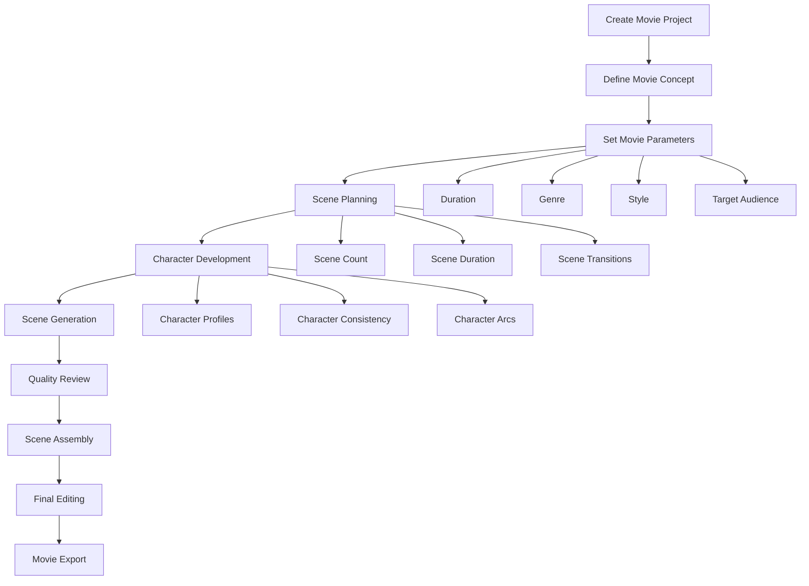

### Scene Generation Process

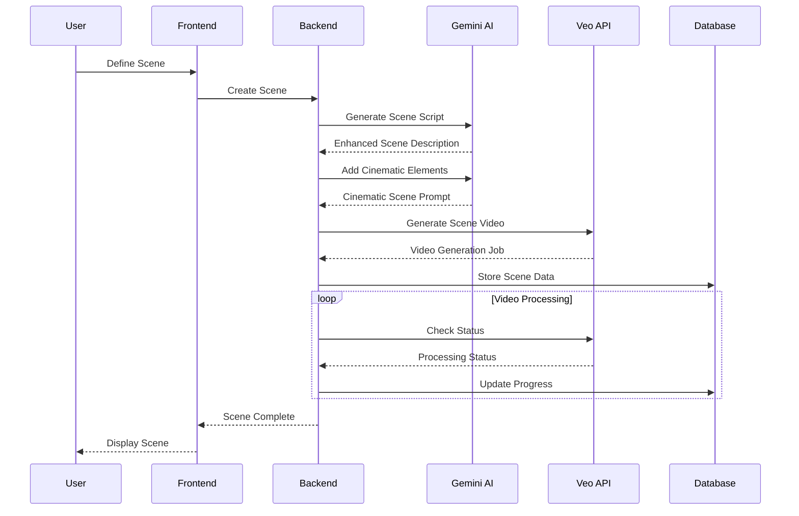

### Character Consistency System

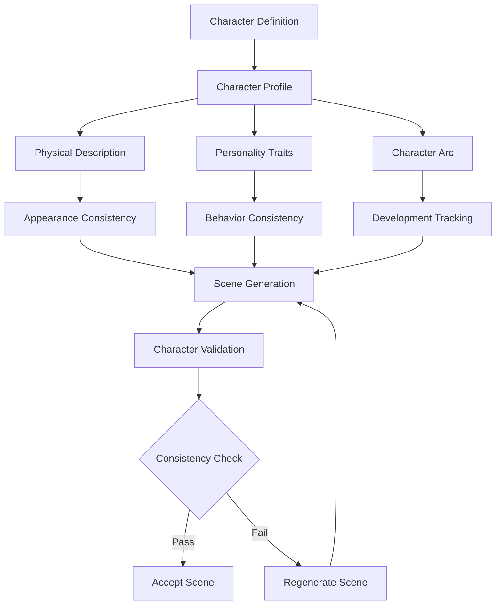

## AI Enhancement Features

### Content Enhancement Pipeline

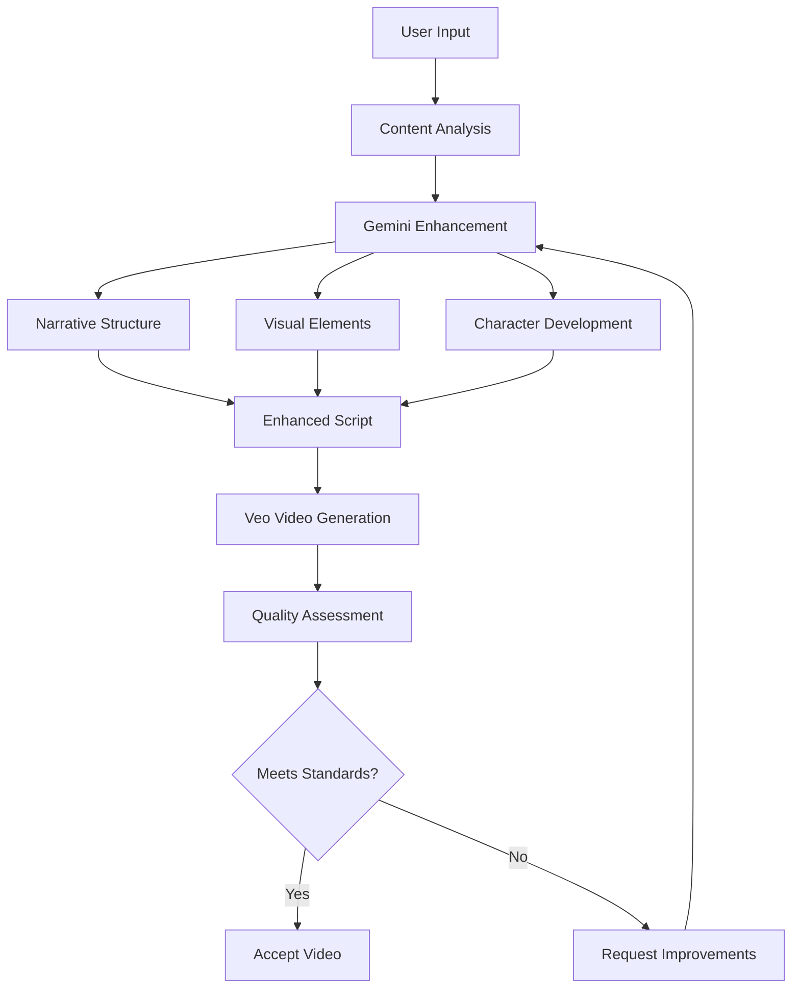

### Style Consistency

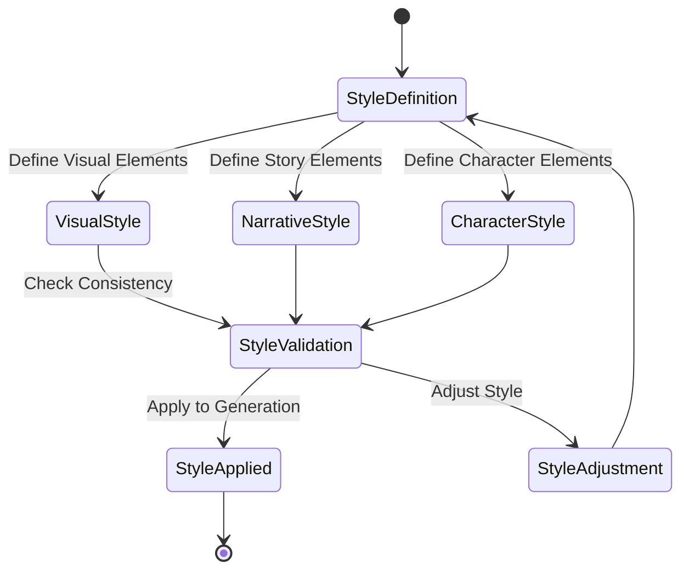

## Project Management

### Project States

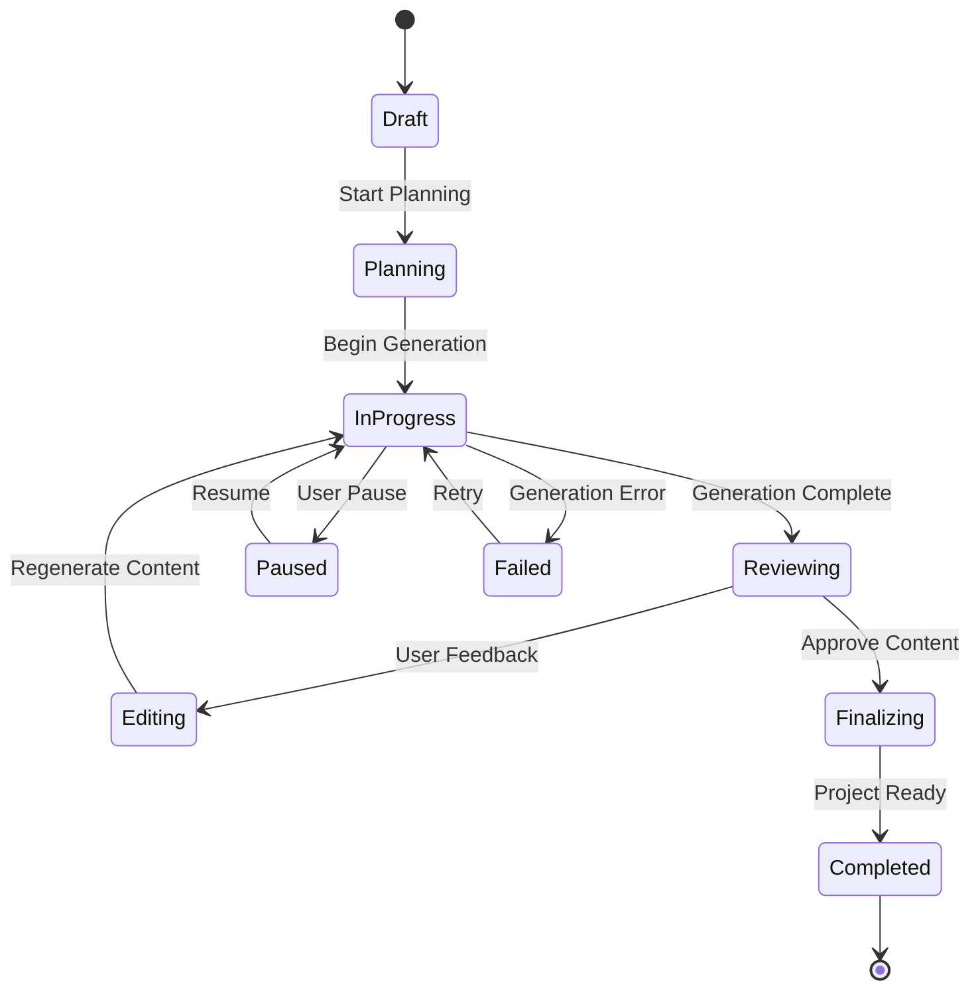

### Progress Tracking

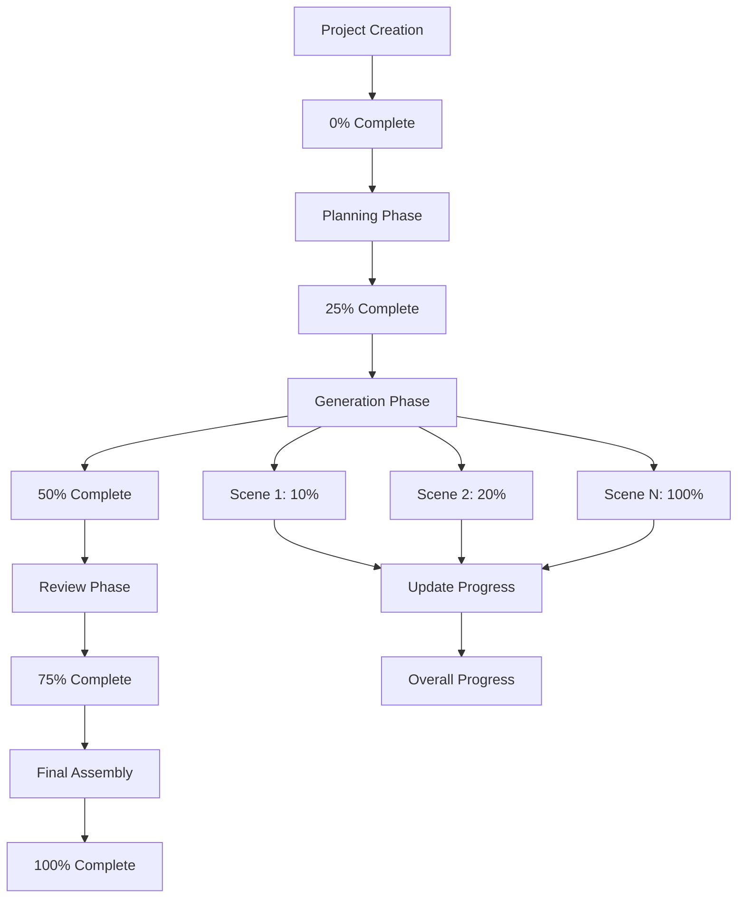

## Export Options

### Export Formats

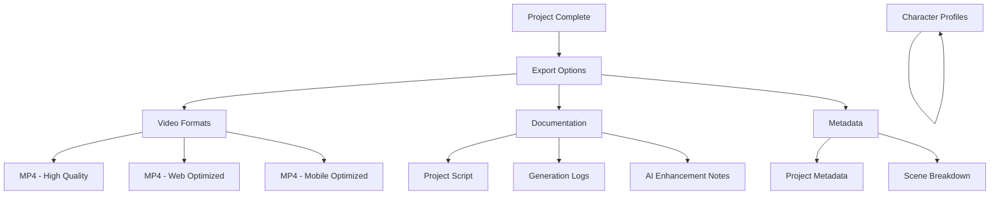

## Best Practices

### Content Creation Tips

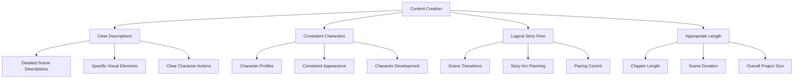

### Quality Assurance

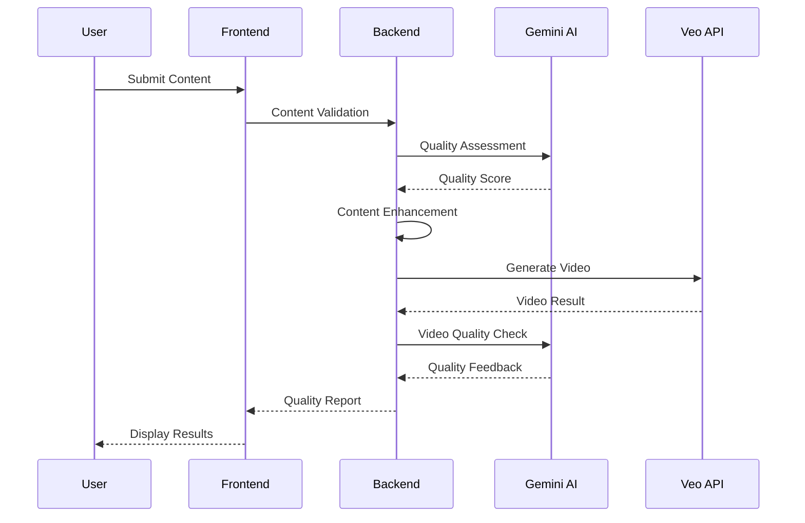

## Troubleshooting

### Common Issues

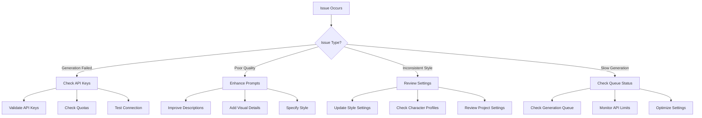

---

## Getting Started

1. **Create a New Project** - Choose between Book or Movie Maker
2. **Define Your Concept** - Enter title, genre, and description
3. **Configure Settings** - Set duration, style, and quality preferences
4. **Generate Content** - Let AI create your project
5. **Review & Edit** - Refine the generated content
6. **Export** - Download your completed project

## Support

- [API Configuration](../api/configuration.md)
- [Troubleshooting Guide](../troubleshooting/common-issues.md)
- [Performance Tips](../performance/optimization.md) 